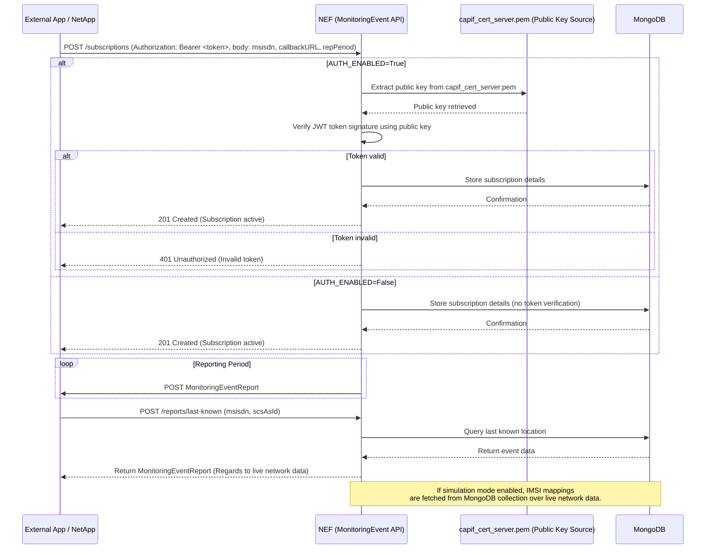
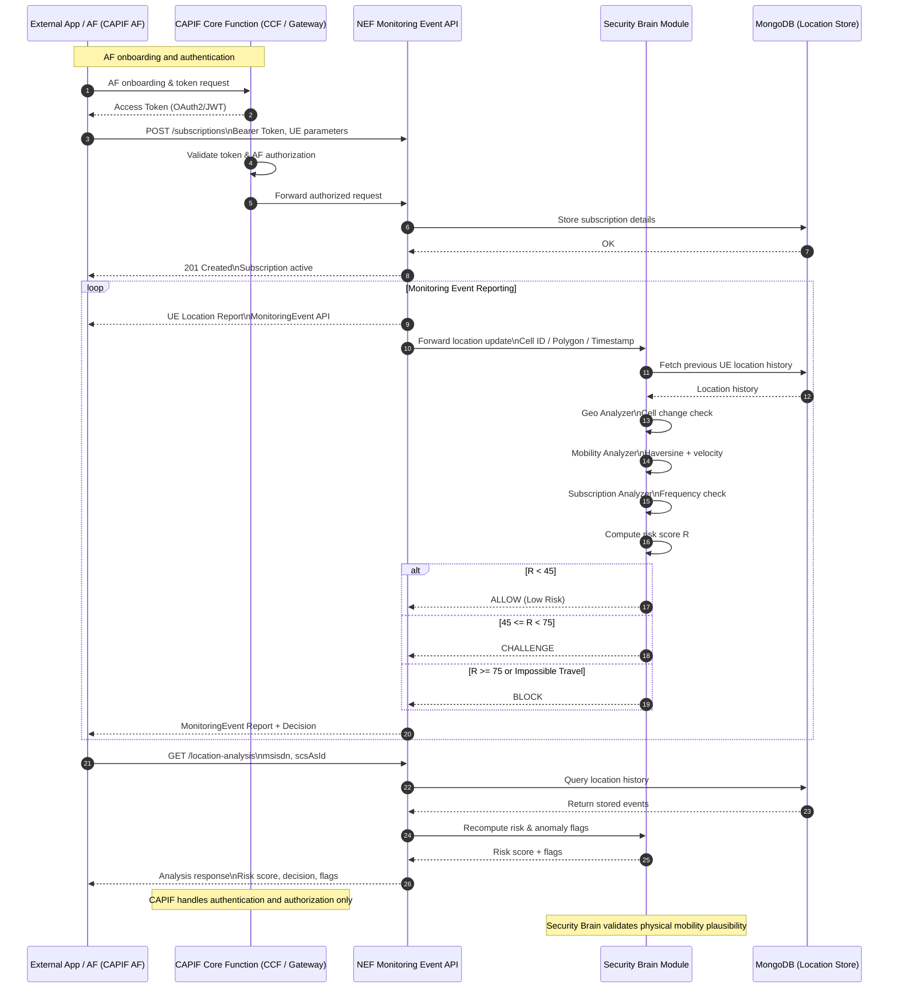

# Mobility-Aware Anomaly Detection in NEF-Based Location Monitoring

This repository provides a **Security Brain** module for the **3GPP Network Exposure Function (NEF) Monitoring Event API**. The module enhances standard NEF location monitoring by validating the **physical plausibility of user mobility** before location events are exposed to third-party applications.

The implementation is built using **Python**, **FastAPI**, and **MongoDB**, and integrates with the **3GPP CAPIF** architecture without modifying the standardized NEF interfaces.

---

# 🧩 Overview

The Security Brain operates as an additional analysis layer between the **NEF Monitoring Event API** and external applications.

Instead of trusting every reported location update, the module evaluates whether consecutive mobility events are physically plausible using mobility-aware anomaly detection techniques.

For every received location update, the Security Brain:

* Retrieves the subscriber's previous location history.
* Computes travelled distance using the Haversine formula.
* Estimates travelling speed.
* Detects impossible travel events.
* Checks abnormal subscription/reporting frequency.
* Computes a composite risk score.
* Returns an access decision (ALLOW, CHALLENGE, or BLOCK).

The module is fully compatible with the **3GPP Monitoring Event API** and requires no modifications to the standardized NEF interfaces.

---

# ⚙️ Features

## 1. Mobility Plausibility Validation

* Detects impossible travel between consecutive location updates.
* Computes travelled distance using the Haversine formula.
* Estimates user velocity.
* Validates realistic mobility behaviour.

---

## 2. Geo Analyzer

* Detects abnormal cell transitions.
* Evaluates polygon-based movement consistency.
* Identifies suspicious location changes.

---

## 3. Subscription Analyzer

* Detects excessive reporting frequency.
* Identifies suspicious monitoring behaviour.
* Incorporates reporting behaviour into the overall risk assessment.

---

## 4. Composite Risk Scoring

The Security Brain combines multiple indicators into a single risk score:

* Geographic consistency
* Mobility plausibility
* Subscription behaviour

Decision policy:

* **R < 45** → ALLOW
* **45 ≤ R < 75** → CHALLENGE
* **R ≥ 75** or **Impossible Travel** → BLOCK

---

## 5. Historical Location Analysis

The module stores previous UE location events in MongoDB and supports:

* Historical mobility analysis
* Risk score recomputation
* Anomaly flag generation
* Location history queries

---

# 🏗️ Architecture

The Security Brain integrates with the standard NEF Monitoring Event API as an additional decision layer.

Workflow:

1. External Application subscribes through CAPIF.
2. NEF receives Monitoring Event reports.
3. Security Brain analyses each location update.
4. MongoDB provides historical location information.
5. Risk score is computed.
6. Decision is returned to the application.

The architecture remains fully compliant with **3GPP TS 29.122** and **CAPIF**, while adding mobility-aware anomaly detection without modifying existing NEF APIs.


# NEF MonitoringEvent API (3GPP TS 29.122)

This repository provides a **Network Exposure Function (NEF)** implementation for the **MonitoringEvent API** as specified in **3GPP TS 29.122**.  
It is built using **Python** and **FastAPI**, containerized via **Docker**, and supports both **CAPIF-enabled** and **non-secure** deployments.

---

## 🧩 Overview

The NEF MonitoringEvent API allows external applications to:
- **Subscribe** to monitoring events such as user **current location**.
- **Receive reports** (via callback URL) based on event occurrences or configured intervals.
- **Query the last known location** for specific subscribers. This is used for integration with northbound APIs like **CAMARA** or **xAPP**.

The implementation follows the **3GPP TS 29.122** specification for MonitoringEvent API and supports integration within the **CAPIF** security framework.

---

## ⚙️ Features

### 1. CAPIF-ready Security
- Controlled via the `.env` file using:  
  ```bash
  AUTH_ENABLED=True
  ```
- When enabled:
  - Deploys NEF MonitoringEvent API as CAPIF-enabled provider app with regards to **CAPIF framework** for secure communication and validation.
  - Provides token verification via **certificate (`capif_cert_server.pem`)** obtained from an external SFTP server.
  - Enables **Swagger UI authorization** for API testing.
### 2. Monitoring Event: Current Location
- Allows users to subscribe for location monitoring of a target MSISDN.
- Parameters that are supported, include:
  - `notificationDestination`: AF's callback URL for receiving MonitoringEvent reports.
  - `maxNumberOfReports`: Maximum number of reports NEF will send.
  - `repPeriod`: Reporting interval in seconds.
- NEF sends MonitoringEventReports based on network-detected location updates.
### 3. Monitoring Event: Last Known Location
- Provides immediate MonitoringEventReport for a given `scsAsId` and `msisdn`.
- Returns the last known location from a subscriber in the database if any record exists.
### 4. Monitoring Event: Last Known Location as MongoDB-based Simulation (CAMARA / xAPP Integration) 
- Same as the above but with:
  -  IMSI mapper collection links **phone numbers ↔ IMSI identifiers**.
  -  CellId to polygon area collection mapper that maps **cellId ↔ polygon coords**
---

## 🏗️ Architecture & Deployment


### Prerequisites
- [Docker](https://www.docker.com/)
- [Docker Compose](https://docs.docker.com/compose/)
- [Make](https://www.gnu.org/software/make/)
- Python 3.12

### Clone the repository
```bash
git clone https://github.com/FRONT-research-group/NEF.git
cd NEF
```

The deployment process is **Makefile-driven** using `docker-compose` files.

### Environment Configuration
All configuration is managed through a `.env` file (see more in the `.env` for **feature related configuration**).

## Deployment Commands
| Command                         | Description                                                                    |
| ------------------------------- | ------------------------------------------------------------------------------ |
| `make deploy`                   | Deploys the NEF application, execute sftp script and configure networks        |
| `make clean`                    | Stops containers, removes volumes, and cleans up networks                      |

To deploy CAPIF-ready deployment, environment variable `AUTH_ENABLED` must be set to `True`.  
After that, the `make deploy` target will deploy 2 `docker-compose` files, one **base** file and one **overlay auth** file, `docker-compose.yaml` and `docker-compose.auth.yaml`, respectively. 

## Initialization & Simulation for Last Known Location as MongoDB-based Simulation
The `init_db_setup` folder includes `python scripts` to prepopulate MongoDB with:

- `CellId to polygon area Coords mapping` entries.
- IMSI mapper entries for test phoneNumbers.
This setup allows the NEF to simulate MonitoringEventReports for northbound APIs.
Create a python `venv` and install `requirements.txt` to execute the `python scripts`.

## 📡 API Summary

### Base Endpoints

| Method  | Endpoint                                                                   | Description                                                      |
| ------- | ---------------------------------------------------------------------------| ---------------------------------------------------------------- |
| `POST`  | `/3gpp-monitoring-event/v1/{scsAsId}/subscriptions`                        | Create a MonitoringEvent subscription (current location)         |
| `GET`   | `/3gpp-monitoring-event/v1/{scsAsId}/subscriptions/`                       | Read all of the active subscriptions for the AF                  |
| `GET`   | `/3gpp-monitoring-event/v1/{scsAsId}/subscriptions/{subscriptionId}`       | Read an active subscription for the AF and the subscription Id   |
| `DELETE`| `/3gpp-monitoring-event/v1/{scsAsId}/subscriptions/{subscriptionId}`       | Deletes an already existing subscription                         |
| `GET`   | `/3gpp-monitoring-event-envelope/v1/{scsAsId}/subscriptions/{subscriptionId}/location-analysis` | Security Analysis: Analyze UE mobility, detect anomalies, compute risk score |

### Example Subscription POST Request - CURRENT LOCATION
```
{
  "accuracy": "CGI_ECGI",
  "msisdn": "001010143245445",
  "notificationDestination": "http://test_server:8001",
  "monitoringType": "LOCATION_REPORTING",
  "maximumNumberOfReports": 3,
  "locationType": "CURRENT_LOCATION",
  "repPeriod": {
    "duration": 20
  }
}
```

### Example Subscription POST Request - LAST KNOWN LOCATION
```
{
  "msisdn": "001010143245445",
  "notificationDestination": "http://test_server:8001",
  "monitoringType": "LOCATION_REPORTING",
  "locationType": "LAST_KNOWN_LOCATION",
}
```

---

### Example Get Request - Security Analysis
---
{
  "msisdn": "810000000000",
  "subscription_id": "c361098b-2632-4b96-b4b7-7297ababb3e0",
  "subscription_active": true,
  "current_location": {
    "cellId": "01630060",
    "location_name": "lat:35.7717, lon:140.2344",
    "trackingAreaId": "TA-01630060",
    "plmnId": {
      "mcc": "440",
      "mnc": "10"
    },
    "coordinates": [
      { "lon": 140.2201, "lat": 35.7620 },
      { "lon": 140.2250, "lat": 35.7620 },
      { "lon": 140.2250, "lat": 35.7670 },
      { "lon": 140.2201, "lat": 35.7670 }
    ],
    "timestamp": "2026-06-29T10:18:35Z"
  },
  "location_history": [
    {
      "cellId": "01630010",
      "location_name": "lat:35.7620, lon:140.2201",
      "trackingAreaId": "TA-01630010",
      "plmnId": {
        "mcc": "440",
        "mnc": "10"
      },
      "coordinates": [
        { "lon": 140.2180, "lat": 35.7600 },
        { "lon": 140.2222, "lat": 35.7600 },
        { "lon": 140.2222, "lat": 35.7640 },
        { "lon": 140.2180, "lat": 35.7640 }
      ],
      "timestamp": "2026-06-29T10:05:10Z"
    }
  ],
  "suspicious": false,
  "risk_score": 8.7,
  "decision": "ALLOW",
  "anomalies": [],
  "message": "Normal mobility pattern detected.",
  "details": {
    "distance_km": 1.42,
    "speed_kmh": 6.35,
    "geo_risk": 10,
    "mobility_risk": 12,
    "subscription_risk": 0
  }
}

---
## 🧩 Sequence Flow Diagram


---
## 🧩 Sequence Flow for Security Module



## Contribution
Contributions are welcome! Please open issues or submit pull requests for improvements.

## License
This project is licensed under the [Apache License 2.0](https://github.com/FRONT-research-group/NEF/blob/main/LICENSE).

## Contact
For questions or support, contact: p.pavlidis@iit.demokritos.gr


